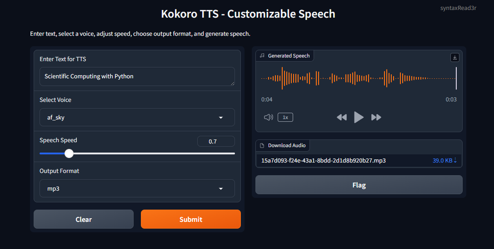

# Kokoro TTS with Gradio UI 🎧



A **Gradio-based web interface** for **Kokoro-FastAPI**, providing **customizable text-to-speech (TTS)** with features like **voice selection, speech speed control, and multiple audio formats**. This setup integrates **FastAPI** and **Docker** to run efficiently on both **CPU** and **GPU**.

---

## **🚀 Features**

✅ **Text-to-Speech (TTS) using Kokoro**  
✅ **Supports multiple voices**  
✅ **Adjustable speech speed**  
✅ **Choose from various audio formats (MP3, WAV, FLAC, etc.)**  
✅ **Dockerized for easy deployment**  
✅ **Supports NVIDIA GPU acceleration**

---

## **📌 Prerequisites**

Before you begin, ensure you have the following installed:

- **Docker Desktop** ([Install Docker](https://docs.docker.com/get-docker/))
- **NVIDIA GPU with CUDA (optional but recommended for GPU usage)**
- **NVIDIA Container Toolkit** ([Setup Guide](https://docs.nvidia.com/datacenter/cloud-native/container-toolkit/install-guide.html))
- **Python 3.9+** (only if running outside Docker)

---

## **💍 Installation & Setup**

Follow these steps to set up the project from scratch on **Windows**:

### **1️⃣ Clone the Repository**

```powershell
git clone https://github.com/Syntax-Read3r/_kokoro_tts_gradio_ui.git
cd _kokoro_tts_gradio_ui
```

### **2️⃣ Choosing Between CPU and GPU Modes**

#### **💪 Running on CPU (Recommended for Simplicity)**

Running the application on CPU is the **easiest** way to get started and does not require an NVIDIA GPU or extra setup:

- Open `docker-compose.yml`
- Locate the service definition for **kokoro-fastapi**
- Replace the GPU image with the CPU image:

```yaml
services:
  kokoro-fastapi:
    image: ghcr.io/remsky/kokoro-fastapi-cpu
```

Then, proceed with **Step 4: Build & Run the Docker Containers** below.

#### **🎯 Running on GPU (For Advanced Users)**

If you want to leverage an **NVIDIA GPU**, follow these additional steps:

1. **Ensure NVIDIA Container Toolkit is Installed**

```powershell
docker run --rm --gpus all nvidia/cuda:12.4.1-base-ubuntu22.04 nvidia-smi
```

✅ If the output shows your GPU, you're good to go!

If not, follow [this guide](https://docs.nvidia.com/datacenter/cloud-native/container-toolkit/install-guide.html).

2. **Modify `docker-compose.yml` to Use GPU Image**

```yaml
services:
  kokoro-fastapi:
    image: ghcr.io/remsky/kokoro-fastapi-gpu:v0.2.1
    deploy:
      resources:
        reservations:
          devices:
            - driver: nvidia
              count: all
              capabilities:
                - gpu
```

3. **Update Docker Configuration**
   Open **PowerShell as Administrator** and configure Docker to use the NVIDIA runtime:

```powershell
notepad $env:ProgramData\Docker\config\daemon.json
```

Add or modify the following lines in the file:

```json
{
	"runtimes": {
		"nvidia": {
			"path": "nvidia-container-runtime",
			"runtimeArgs": []
		}
	}
}
```

Save the file and restart Docker Desktop:

```powershell
Restart-Service docker
```

---

### **4️⃣ Build & Run the Docker Containers**

Run the following command to **build and start the services**:

```powershell
docker-compose up --build
```

This will:

- Start **Kokoro-FastAPI** (Text-to-Speech API)
- Start **Gradio UI** for interaction

If everything is working, you should see output similar to:

```
Running on http://0.0.0.0:7860
```

Open **http://localhost:7860** in your browser to use the interface.

---

## **🛠️ Troubleshooting**

### **GPU Not Detected in Docker?**

- Run:
  ```powershell
  docker run --rm --gpus all nvidia/cuda:12.4.1-base-ubuntu22.04 nvidia-smi
  ```
- If it **fails**, ensure **NVIDIA Container Toolkit** is installed ([Guide](https://docs.nvidia.com/datacenter/cloud-native/container-toolkit/install-guide.html)).

### **Corrupted Docker Layers?**

If you encounter **layer extraction errors**, clear the cache and rebuild:

```powershell
docker system prune -a --volumes
docker-compose up --build
```

### **Port Already in Use?**

Ensure no other instance is running:

```powershell
docker ps  # Check running containers
docker-compose down  # Stop all services
```

---

## **📚 Documentation & References**

- **FastAPI Integration Guide**: [Kokoro-FastAPI Integration](https://docs.openwebui.com/tutorials/text-to-speech/Kokoro-FastAPI-integration)
- **Gradio Documentation**: [Gradio](https://www.gradio.app/)

---

## **💜 License**

This project is licensed under the **MIT License**. See the [LICENSE](LICENSE) file for details.

---

## **👨‍💻 Author & Contributions**

**Developed by: SyntaxRead3r**  
Contributions are welcome! Feel free to submit a **pull request** or open an **issue**.
